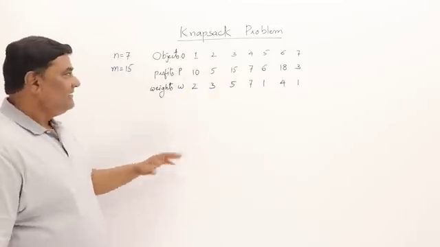
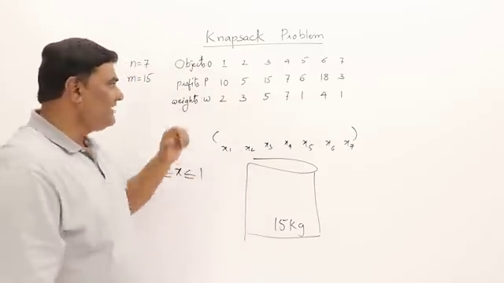
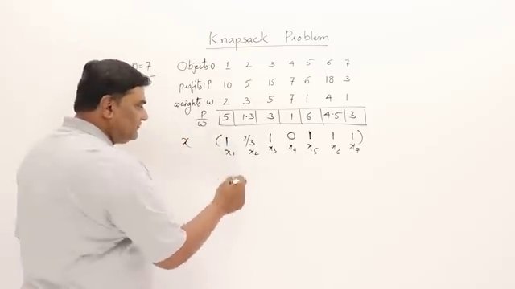

# Research Document: oTTzNMHM05I

Video URL: https://www.youtube.com/watch?v=oTTzNMHM05I

## 1. visual - A table showing the seven objects, their weights, and their profits.

Timestamp: 00:20

**Knapsack Problem (00:20):**

The video at 00:20 illustrates the knapsack problem using a table.  This problem involves selecting a subset of items (objects) to maximize profit while staying within a weight limit (knapsack capacity – not explicitly shown here).

* **Key Elements:**
    * **Objects:** Seven items, each with a specific weight and profit.
    * **Weight:**  Individual weight of each object.
    * **Profit:** Value or profit associated with each object.
* **Goal:**  Determine which objects to include to achieve the maximum possible total profit without exceeding the weight capacity.  The table provides the necessary data to solve this optimization problem.  Different solution methods (e.g., greedy, dynamic programming) can be applied.

---

## 2. visual - A table showing the calculation of profit per weight for each object.

Timestamp: 06:30

**Profit per Weight Calculation (06:30)**

This table analyzes profitability based on weight, crucial for optimizing resource allocation.  It compares:

* **Selling Price:** Revenue generated per unit.
* **Weight:**  The mass of each object.
* **Cost Price:**  The expense of producing/acquiring each object.
* **Profit:** Selling Price - Cost Price.
* **Profit per Weight:** Profit / Weight.  This metric reveals which items yield the highest profit relative to their mass, indicating potentially higher efficiency.

Analyzing this data allows informed decisions on which products to prioritize based on weight-adjusted profitability, aiding inventory management and resource optimization.

---

## 3. visual - A step-by-step visualization of the greedy algorithm, showing the knapsack filling up with objects based on the profit/weight ratio.  The visualization should include a table updating the remaining knapsack capacity and accumulated profit at each step.

Timestamp: 07:44

**Greedy Algorithm: Knapsack Problem Visualization (07:44)**

The greedy algorithm solves the knapsack problem by iteratively selecting the most profitable items per unit weight.

*   **Step-by-step:** Items are considered based on their profit/weight ratio (highest first).
*   **Selection:** An item is added if it fits within the remaining knapsack capacity.
*   **Tracking:**  A table dynamically updates remaining capacity and total profit after each item selection.
*   **Optimal?**  The greedy approach doesn't guarantee the absolute best solution (global optimum) but provides a reasonably good approximation (local optimum) efficiently.  It's especially useful when the problem is computationally complex.

---

## 4. text - A detailed explanation of the calculation of total weight and profit, including the specific equations and how fractional objects are handled in the calculation.  Include clear examples of the multiplications and additions done.

Timestamp: 10:35

**Calculating Total Weight & Profit (10:35)**

* **Total Weight:**  Sum the weight of each item.  Handle fractional weights directly in calculations (e.g., 2.5kg + 1.7kg = 4.2kg).

* **Profit:**  Profit per unit * number of units.

* **Example:** 5 units weighing 2.2kg each, profit of $5/unit.

    * Total weight: 5 units * 2.2kg/unit = 11kg
    * Total profit: 5 units * $5/unit = $25

* **Fractional Units:**  Calculate weight and profit proportionally.  e.g., 2.5 units at $5/unit yields a profit of $12.50 and a weight of 2.5 units * (unit weight).

* **Total Calculation:** Sum individual item weights to get total weight; sum individual item profits to get total profit.

---

## Summary

This video demonstrates the greedy algorithm applied to the fractional knapsack problem.  It visually guides viewers through selecting items to maximize profit within a weight constraint.  Key takeaways include:  1) the algorithm prioritizes items with the highest profit-to-weight ratio; 2) fractional items are allowed, optimizing profit; 3) the video clearly shows the step-by-step process of calculating profit and remaining capacity, using equations and examples.

